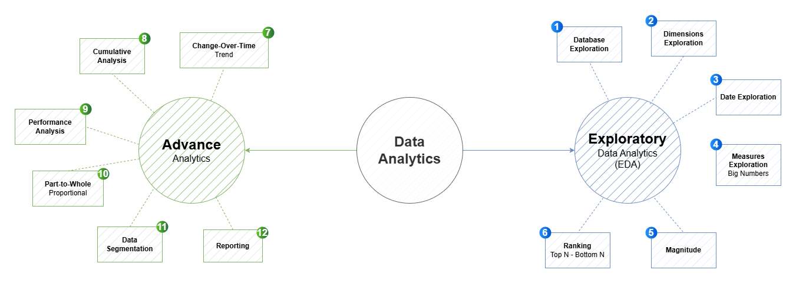

# 📊 SQL Data Analysis Project



## 📌 Project Overview

This project is a comprehensive SQL-based data analysis initiative inspired by the following video tutorials:

- [Video 1: SQL for Data Analysis](https://youtu.be/6cJ5Ji8zSDg?si=qebmRquQ_XqDZRLa)
- [Video 2: Advanced SQL Techniques](https://youtu.be/2jGhQpbzHes?si=_gCKgDE9qiL-aYYE)

The goal is to explore, analyze, and extract meaningful insights from a relational database using structured queries — from basic exploration to advanced analytics.

---

## 🧭 Project Roadmap

The image above outlines the step-by-step progression of this project:

### 1. Dimensions Exploration

- Identify and understand dimension tables
- Analyze categorical attributes

### 2. Database Exploration

- Inspect schema, tables, and relationships
- Understand data types and constraints

### 3. Exploratory Data Analysis (EDA)

- Distribution of values
- Missing data and outliers
- Summary statistics

### 4. Data Analytics

- Aggregations and groupings
- Trend analysis
- Comparative metrics

### 5. Measures Exploration

- Key performance indicators (KPIs)
- Big numbers (e.g., total sales, counts)

### 6. Ranking & Magnitude

- Top N and Bottom N analysis
- Magnitude comparisons (e.g., highest/lowest values)

---

## 🗂️ SQL Scripts Included

All SQL scripts used in this project are available in this repository. Below is the list of scripts (you can rename these as per your actual files):

| Script Name                     | Description                                            |
| ------------------------------- | ------------------------------------------------------ |
| `01_dimensions_exploration.sql` | Explore dimension tables and attributes                |
| `02_database_exploration.sql`   | Inspect schema, tables, and relationships              |
| `03_exploratory_analysis.sql`   | Initial data exploration (distributions, nulls, stats) |
| `04_data_analytics.sql`         | Aggregations, groupings, and trends                    |
| `05_measures_exploration.sql`   | Compute key business measures                          |
| `06_ranking_top_bottom.sql`     | Top N and Bottom N queries                             |
| `07_magnitude_analysis.sql`     | Magnitude-based comparisons                            |

> 📁 All `.sql` files are located in the `/scripts` folder.

---

## 🛠️ Technologies Used

- **SQL** (Standard syntax compatible with PostgreSQL/MySQL/SQL Server)
- **Database**: [e.g., AdventureWorks, Northwind, or your custom DB]
- **Tools**: [e.g., DBeaver, pgAdmin, Azure Data Studio, VS Code]

---

## 🚀 How to Run

1. Clone this repository:
   ```bash
   git clone https://github.com/yourusername/your-repo-name.git
   ```
2. Import or connect to your target database.
3. Run the SQL scripts in the order listed above.
4. Adjust table/column names to match your schema if needed.
